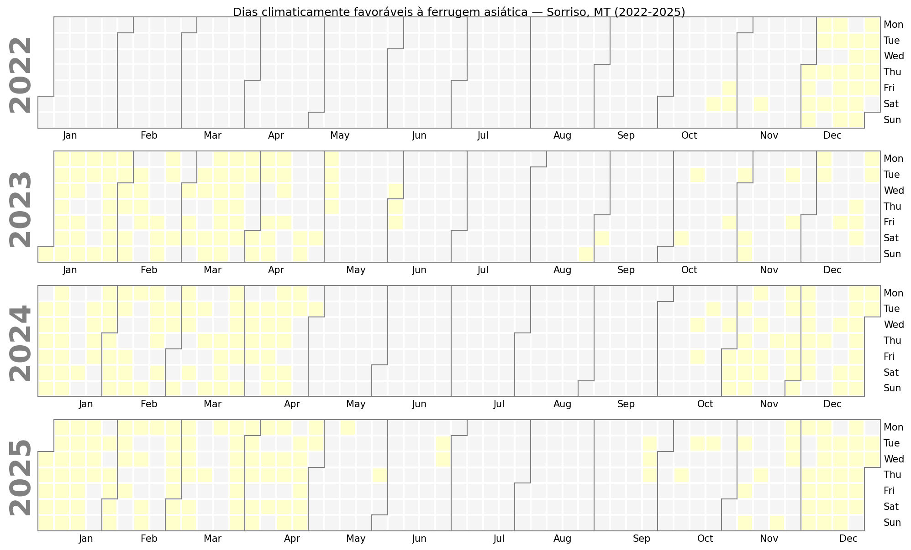
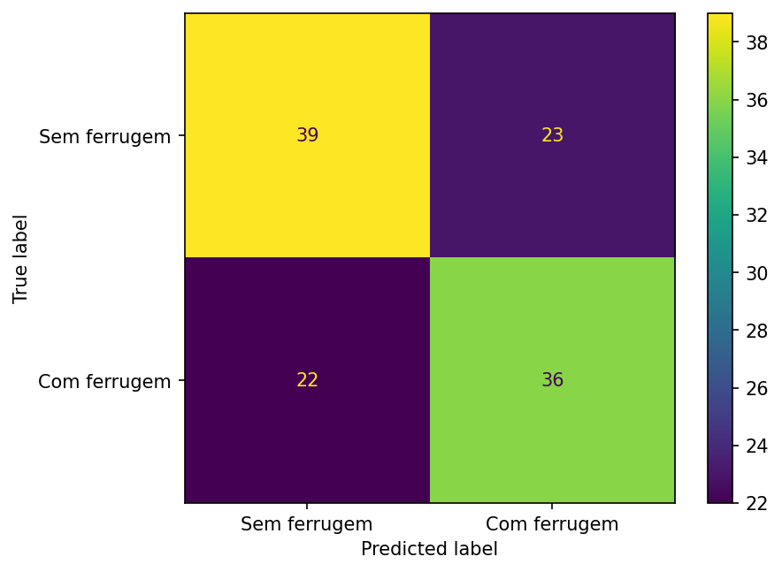
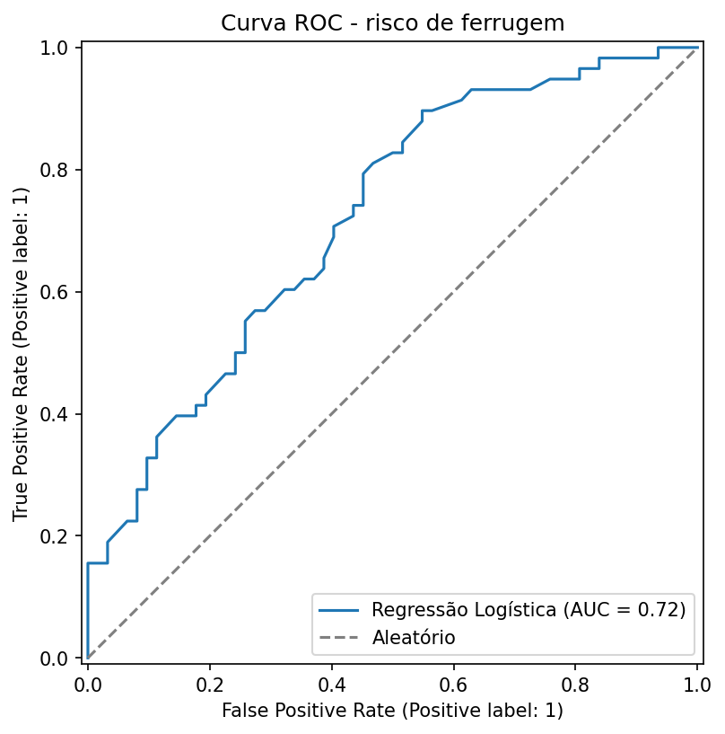
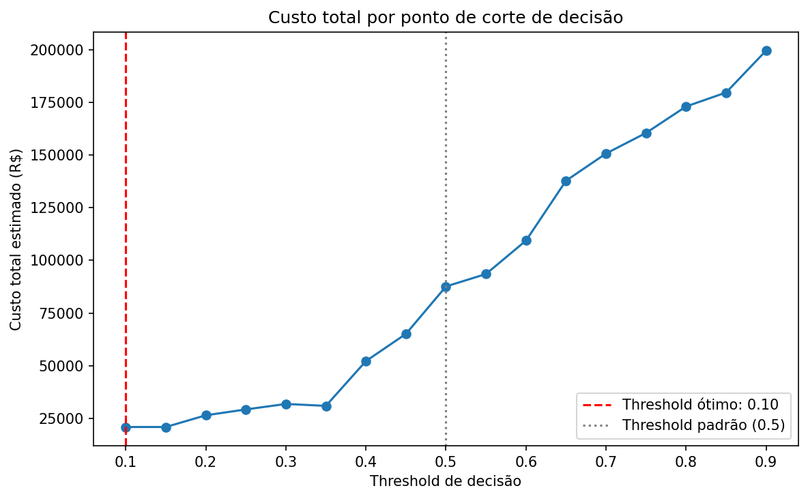

# Previsão de Risco de Ferrugem Asiática da Soja

Projeto de portfólio que estima o risco de um talhão de soja desenvolver ferrugem asiática, cruzando clima real com uma simulação de manejo agrícola. O tipo de problema que empresas de proteção de cultivo resolvem no dia a dia: saber onde e quando agir antes que a doença se instale.

Ferrugem asiática é uma das doenças mais custosas da soja no Brasil. O risco dela está ligado a condições climáticas bem conhecidas na agronomia: temperatura entre 15°C e 28°C combinada com muitas horas seguidas de alta umidade favorece o fungo.

O padrão sazonal real de Sorriso-MT: dias climaticamente favoráveis se concentram na estação chuvosa (outubro a abril), coincidindo com a janela de plantio e desenvolvimento da soja, e praticamente desaparecem na seca (maio a setembro).

## Dados

Duas fontes, com critério claro sobre o que é real e o que é simulado.

**Clima (real).** Cinco anos (2021 a 2025) de dados horários da estação meteorológica automática do INMET em Sorriso, Mato Grosso (código A904), um dos maiores polos de soja do Brasil. Baixados direto do banco de dados histórico oficial do INMET. Depois de remover falhas de sensor, sobraram cerca de 27 mil registros horários, cobrindo as safras 2022/23 a 2024/25 por completo.

**Talhões e manejo (simulado).** 600 talhões fictícios de soja, cada um com data de plantio dentro da janela real de semeadura (setembro a novembro), cultivar com suscetibilidade variável à ferrugem (baixa, média, alta) e indicação de aplicação preventiva de fungicida. Incidência de doença por talhão e uso de defensivo por produtor não são dados públicos em lugar nenhum, então essa camada é simulada, mas construída em cima do clima real de cada janela específica.

## Indicador de risco climático

Cada dia do histórico foi marcado como favorável à ferrugem quando teve pelo menos 6 horas de umidade relativa acima de 90% e temperatura média entre 15°C e 28°C. É uma aproximação (o ideal seria sensor de folha molhada, que a estação não tem), mas segue a mesma lógica de sistemas reais de alerta fitossanitário quando esse sensor não existe.

374 dos 1.168 dias analisados (32%) tiveram condição favorável, número plausível pro clima de Sorriso.

## Modelagem

Cada talhão foi cruzado com o clima real da própria janela crítica (45 a 95 dias após o plantio, os estágios reprodutivos R1 a R5 da soja). A incidência de ferrugem foi simulada como função de três fatores: dias climaticamente favoráveis na janela, suscetibilidade da cultivar e uso de fungicida preventivo.

A primeira versão do modelo usou `LabelEncoder` pra transformar a suscetibilidade da cultivar em número, o que atribuiu valores por ordem alfabética (alta=0, baixa=1, média=2) em vez de ordem de risco real. Isso quebra a relação que um modelo linear precisa enxergar, e a acurácia ficou em 57%, quase chute. Trocando pela codificação correta (baixa=0.5, média=1.0, alta=1.6, na ordem real de risco), a acurácia subiu pra 62%, com recall balanceado entre as duas classes (0.63 e 0.62). Erro de codificação de variável categórica não avisa: o modelo treina normal e só entrega resultado ruim.

## Resultado final

| Métrica | Valor |
|---|---|
| Acurácia | 0.62 |
| Recall (com ferrugem) | 0.62 |
| AUC | 0.72 |

AUC de 0.72 com só três variáveis é honesto: separa bem os dois grupos, mas está longe de perfeito, esperado dado o ruído que entra de propósito na simulação.

## O que mais pesa na decisão

- **Suscetibilidade da cultivar** (0.62) e **dias climaticamente favoráveis** (0.61) pesam quase igual a favor do risco.
- **Aplicação de fungicida preventivo** (-0.57) reduz o risco de forma consistente.

## Ranking de talhões por risco

A saída mais útil aqui não é a classificação binária, é a probabilidade de cada talhão, ordenada. Dos 15 talhões de maior risco na base de teste, 12 realmente desenvolveram ferrugem, e quase todos compartilham o mesmo perfil: cultivar de alta suscetibilidade sem fungicida preventivo. É a lista que orientaria uma equipe agronômica sobre onde priorizar aplicação primeiro. Ranking completo em `ranking_risco_ferrugem.csv`.

## Custo-benefício do ponto de decisão

O modelo entrega uma probabilidade, mas decidir a partir de qual probabilidade vale a pena tratar preventivamente não deveria usar o padrão estatístico de 50% sem questionar. Essa decisão depende do custo relativo de cada tipo de erro: tratar um talhão que não precisava, ou deixar de tratar um que precisava.

Usando valores ilustrativos de custo (aplicação de fungicida preventivo em torno de R$180/ha, perda esperada por ferrugem não tratada em torno de R$3.500/ha), testei o custo total da base de teste em diferentes pontos de corte.

| Cenário | Custo total |
|---|---|
| Threshold ótimo (0.10) | R$ 20.880 |
| Tratar todos os talhões | R$ 21.600 |
| Threshold padrão (0.5) | R$ 87.620 |
| Não tratar nenhum talhão | R$ 203.000 |

O achado mais importante não é o número isolado, é a comparação entre eles. O threshold ótimo economiza 76% frente ao padrão de 0.5, mas fica muito próximo do custo de simplesmente tratar todos os talhões sem usar modelo nenhum. Isso acontece porque a perda por ferrugem não tratada é quase 20 vezes maior que o custo do fungicida: quando o custo de um tipo de erro é tão mais alto que o do outro, a decisão financeiramente ótima tende a ser tratar quase tudo, e o modelo só agrega valor real na fatia de talhões onde dá pra economizar o fungicida com segurança. Em um cenário com custos mais equilibrados entre tratamento e perda, o modelo teria impacto financeiro bem maior que o observado aqui.

## Limitações

- A camada de talhões e manejo é simulada. O clima é real e verificável, mas a relação entre clima, suscetibilidade e incidência foi definida por mim de forma simplificada, não medida em campo.
- Só uma divisão de treino/teste foi usada. O resultado pode mudar com outra divisão; o ideal seria validação cruzada.
- O indicador de umidade alta é proxy pra folha molhada, não a medição direta que agronomia de precisão usa.
- Uma estação meteorológica representa uma região inteira, mas o clima varia dentro do próprio município.
- Os valores de custo de fungicida e perda por ferrugem são ilustrativos, escolhidos por plausibilidade e não retirados de uma fonte específica documentada. A conclusão sobre onde fica o threshold ótimo depende diretamente desses números; com valores reais de mercado, o resultado poderia mudar.

## Próximos passos

- Incorporar mais de uma estação meteorológica por região
- Testar modelos não lineares (Random Forest, XGBoost) e comparar
- Validação cruzada pra estimativas mais robustas
- Explorar dados de sensoriamento remoto (NDVI) como proxy de estresse da cultura

## Ferramentas

Python, pandas, numpy, scikit-learn, matplotlib, calplot, dados históricos oficiais do INMET, Google Colab
